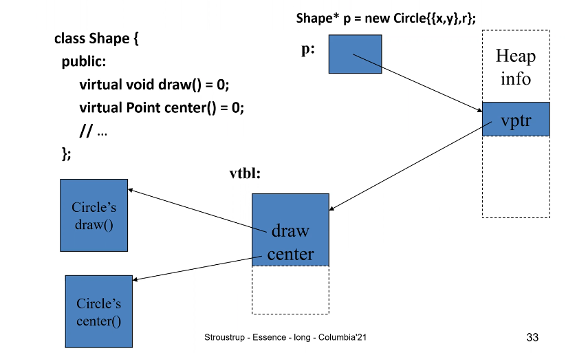
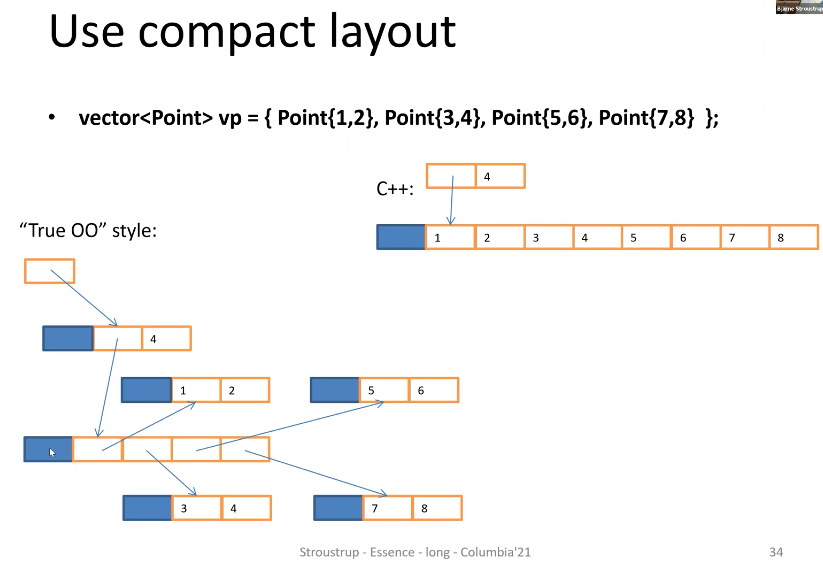
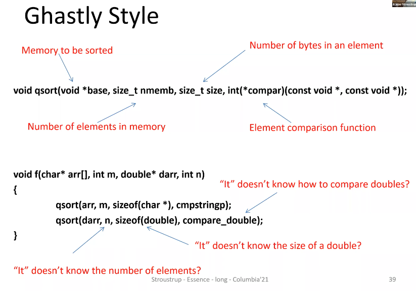
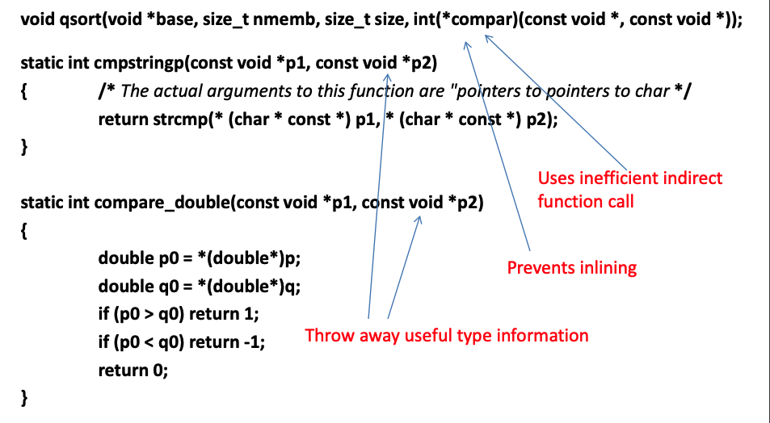
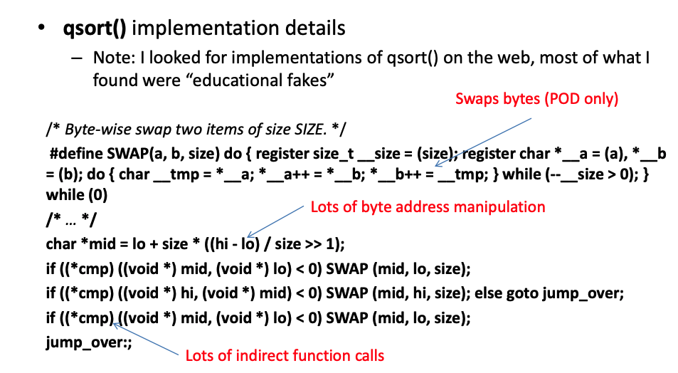

# Design using C++
## Lecture 1
### What is C++
* Aims and constraints
  * Language for defining and using light*weight abstractions
    * elegant and efficient abstractions
  * Offers
    * direct map to hardware
      * of instruction and fundamental data types
      * Initially from C
      * primitive operations maps to machine instruction
      * memory is a set of sequence object, where pointers are machine addresses
      * objects can be composed by simple concatenation (arrays, classes/structs)
      * the simplicity of this mapping is one key to C/c++ success (simple abstraction of hardware)
    * zero-overhead abstraction
      * classes w/ constructors/destructors, inheritance, generic programming, functional programming techniques
      * Initially from Simula (not zero-overhead)
  * Key strengths:
    * software infrastructure
    * resource constrained applications
  * Goals:
    * Type safety: encapsulate necessary unsafe operation
    * Resource safety: it's not all memory
    * Readability: people & machines ("analyzability")
    * Predictability: for hard and soft real time
    * Performance: for some parts of almost every system, it's important
    * Teachability: complexity of code should be proportional to complexity of the task
  * Different projects have diff. constraints
    * hardware resources
    * reliability constraints
    * efficiency constraints (time, power)
    * developer skills
    * time to completion
  * Language: synthesis, an integrated set of language features and standard-library components
    * C++11/14/17: Clang, GCC, MS C++
  * Use: articulated [guidelines](https://github.com/isocpp/CppCoreGuidelines)
* Memory Model
```cpp
class Point {
  int x, y;
  //...
}
// sizeof(Point) == 2 * sizeof(int)
Point* p = new Point{1, 2};
// memory used for p: sizeof(Point*) + sizeof(Point) + Heap_info
```
  * class hierarchy
  ```cpp
  class B {
    int b;
  }; 
  class D: public B {
    int d;
  }; 
  B x;
  D y;
  ```
  * OOP with runtime binding (polymorphic type)
  ```cpp
  class Shape {
    public:
      virtual void draw() = 0;
      virtual Point center() = 0;
      // ...
  };
  Shape* p = new Circle{{x, y}, r}
  ```
<!-- 
 -->
<p align="center">
  
  <br/>
</p>
<p align="center">
  
  <br/>
</p>
* "Multi-paradigm" is not good enough
  * The styles/paradigms were never meant to be disjoint
  * C style
    * functions and structures
    * Typically lots of macros, void*, and casts
  * C++85 style (aka "C with classes")
    * classes, class hierarchies, and virtual functions
  * "True OO" style
    * just class hierarchies
    * often lots of casts and macros
  * Generic C++
    * Everything is a template
  * Functional C++
    * Everything involves a lambda
  * styles and features are used incombination
    * for the best solution to specific problems
    * for different parts of larger programs
  * the purpose of programming language is to help express solution to problems clearly
    * for c++, a large variety of problems
  * look to design techniques
    * not so much to language features
    * C++ core guidelines
### Ghastly style
* `qsort()` example
  <p align="center">
    
    <br/>
  </p>
  <p align="center">
    
    <br/>
  </p>
  <p align="center">
    
    <br/>
  </p>
* We want:
  * simple interfaces
  ```
  void sort(Sortable auto&) // for any container (vector, list, array, etc) with elements that can be compared to C++20
  ```
  * simple calls
  ```
  vector<string> vs;
  //...
  sort(vs); // standard in C++20, can be done in C++11
  ```
  * uncompromising performance: std::sort() beats qsort() by large factor
  * direct map to hardware like C
  * no static type violation
  * no resource leaks
### Type-rich Programming
* Interfaces
  * overly general/underspecified -> better
  * `void increase speed` to `void increase_speed(Speed)`
  * `Object obj; .. obj.draw()` to `Shape& s; ... s.draw();`
  * `Rectangle(int, int, int, int)` to `Rectangle(Point top_left, Point bottom_right);` or `Rectangle(Point top_left, Box_hw b)`
* SI-units example
  * Simple and effective
    * `Speed sp1 = 100m/9.8s;` // very fast for human
    * `Speed sp2 = 100m/9.8s2;` // error m/s2 is acceleration
    * `Speed sp3 = 100/9.8s;` // error speed is m/s
    * `Acceleration acc = sp1/0.5s;` // too fast for a human
  * We can define units to be handled at compile time and no run-time overheads:
    ```cpp
    template<int M, int K, int S> struct Unit { // a unit in the MKS system
      enum {m=M, kg=K, s=S};
    };
    template<typename Unit> // a magnitude with a unit, feeding into type system to associate Unit with Value
    struct Value {
      double val; // the magnitude
      explicit Value(double d) : val(d) {} // construct a Value from a double
    };
    using Speed = Value<Unit<1,0,-1>>; // meters/second type
    using Acceleration = Value<Unit<1,0,-2>>; // meters/second/second type
    Speed sp1 = Value<1,0,0>(100)/Value<0,0,1>(9.8); // very explicit
    Speed sp2 = Value<M>(100)/Value<S>(9.8); // use a shorthand notation
    Speed sp3 = Meters(100)/Seconds(9.8); // abbreviate further still
    Acceleration acc = M(100)/S(9.8); // this is getting cryptic
    ```
  * So, improve notation using user-defined literals:
    ```cpp
    using Second = Unit<0,0,1>; // sec
    using Second2 = Unit<0,0,2>; // second * second

    constexpr Value<Second> operator"" s(long double d) {
      // a f-p literal suffixed by 's'
      return Value<Second> d;
    }
    constexpr Value<Second> operator"" s2(long double d) {
      // a f-p literal suffixed by 's2'
      return Value<Second2> d;
    }
    ```
* Style
  * Keep interfaces strongly typed
  * Avoid very general types in interfaces, e.g., 
    * int, double, ...
    * Object, ...
  * General types can represent just about anything
    * Checking of trivial types finds only trivial errors
    * Use precisely specified interfaces
### Resource management

### OOP: Classes & Hierarchies

### GP: Templates

### Concurrency 

### Challenges
